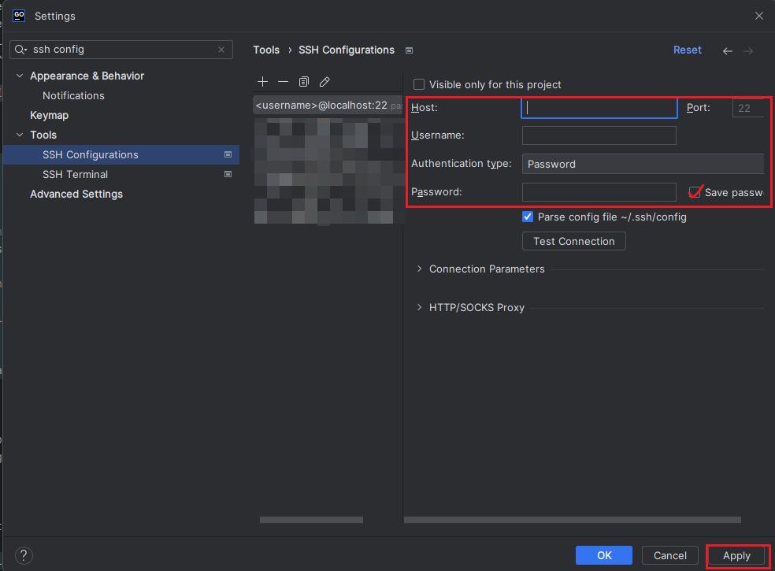
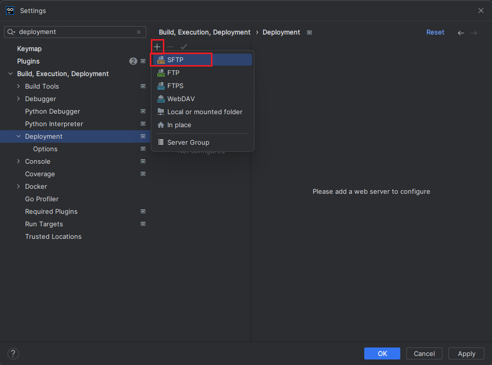
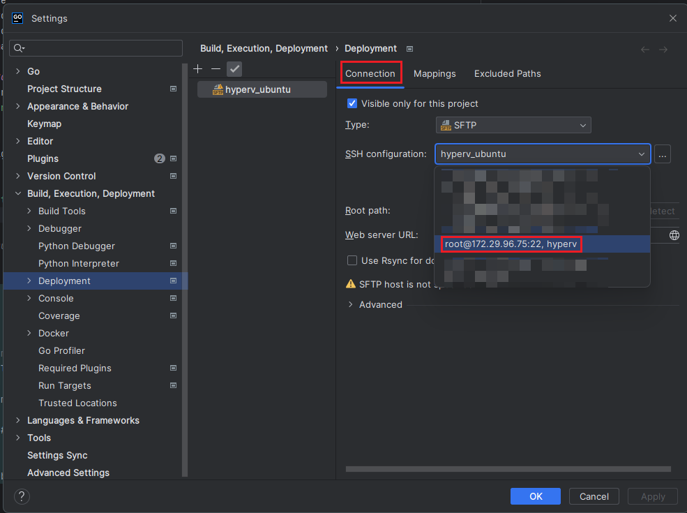
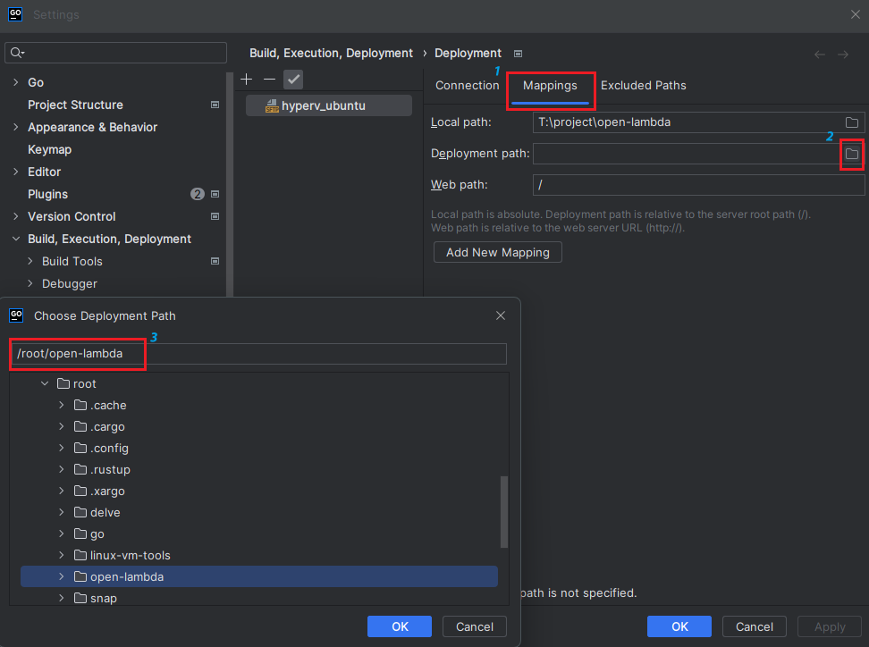
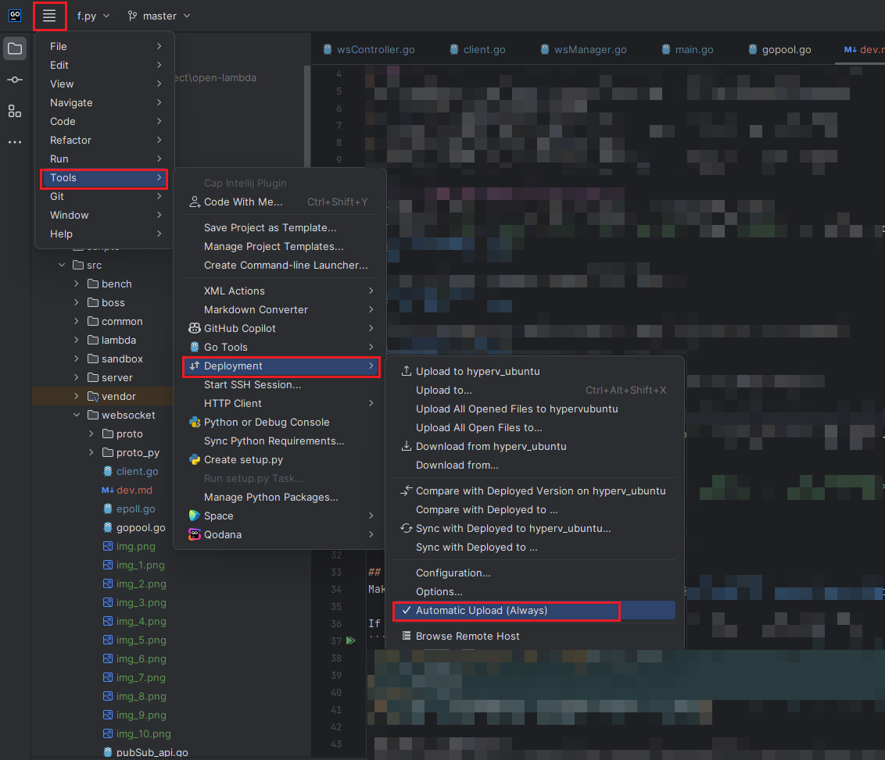
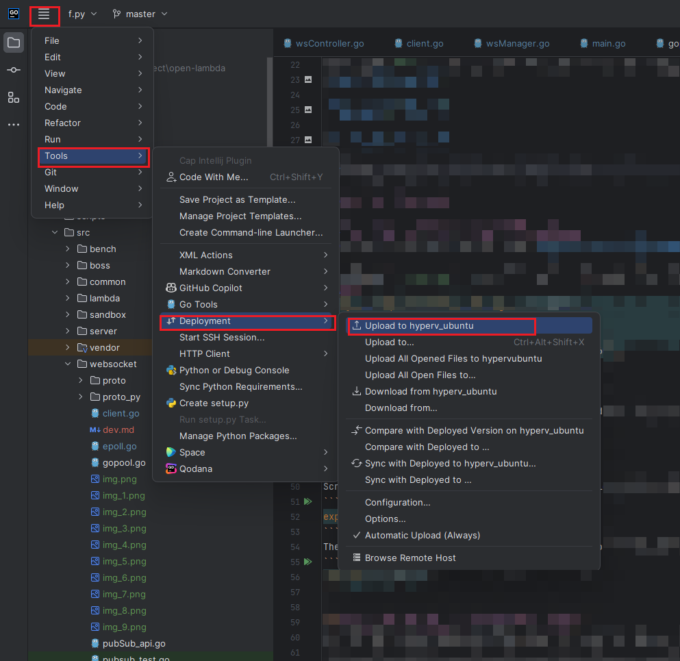
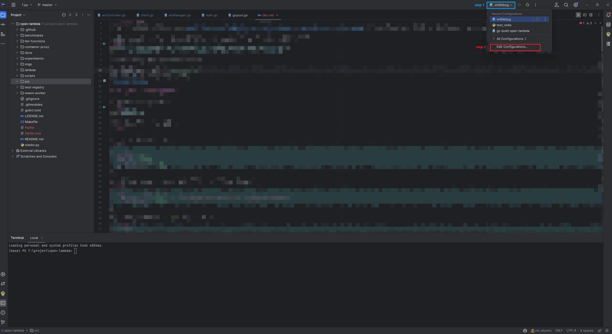
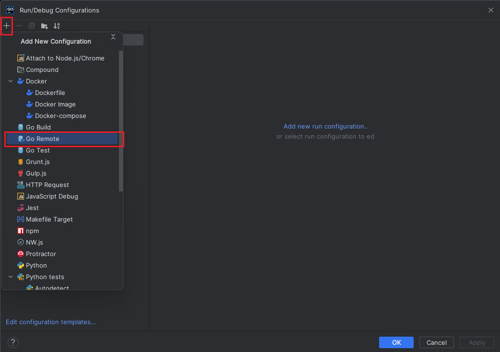
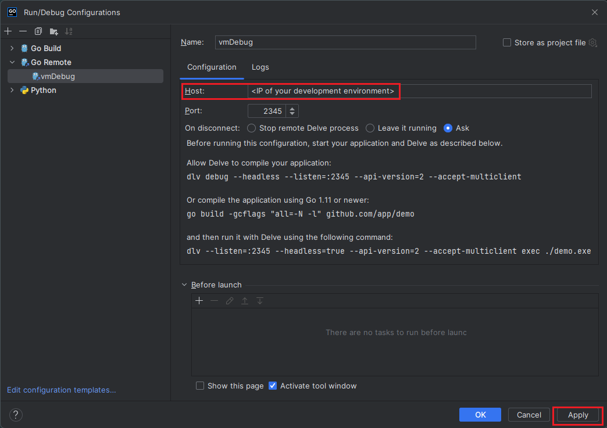
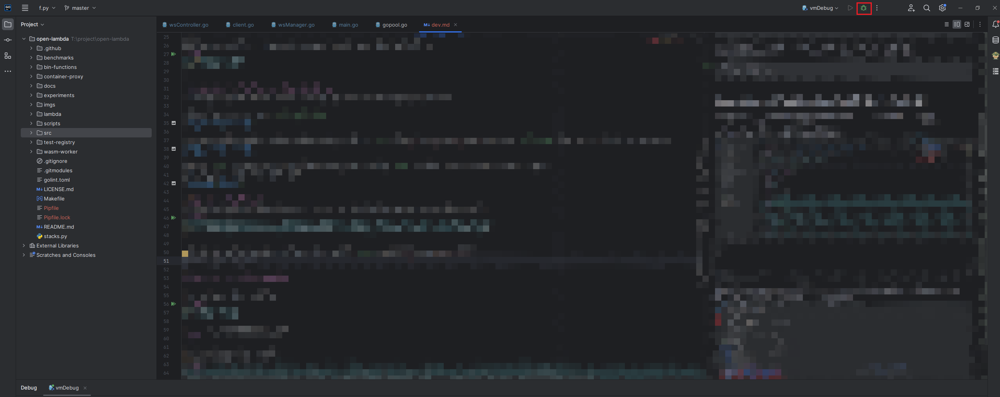

This document is a guide for developers to set up auto deployment and debug environment for the websocket server.
I code in Goland running on Windows, and the websocket server runs on a remote machine. The code are automatically deployed to the remote machine by Goland.

My remote machine environment: Ubuntu 22.04, go version go1.18.3 linux/amd64. All the following instructions are based on this environment.

Goland UI may varies, as I am using so-called `new UI` (you can find and switch to it in the settings), which is different from the `classic UI`.

Before setup auto deployment and debug, you are expected to finish the following steps:
1. Install go on the remote machine
2. Make sure ssh connection works between your local machine and the remote machine
3. Install Goland on your local machine (use student email to get it for free)
4. Clone another in your local, open it with Goland
5. Clone the repo to your remote machine and successfully build the project


# deploy

ctrl+alt+s -> Tools -> SSH Configurations -> add new configuration.
Fill in the `Host`, `Port`, `User name`, `Auth type` and `Password` according to your remote machine's environment.


Then create a new deployment configuration (SFTP). 


In the SSH configuration column, choose the SSH connection you just created.


Fill in the `Mappings` according to your repo path in the remote machine.


click menu `Tools` -> `Deployment` -> `Automatic Upload` to enable auto deployment.


At the end, click menu `Tools` -> `Deployment` -> `Upload to <your deployment name>` to upload the code to the remote machine (you just need to do this once).


# debug (using Goland)

## step 1: install delve on the remote machine
Make sure you correctly install delve ([install instruction](https://github.com/go-delve/delve/tree/master/Documentation/installation)) in the remote machine and open the port 2345 for remote debugging.

If running `dlv version` in the remote machine and you see something like this:
```bash
root@samuraiy-Virtual-Machine:~/go# dlv version
Delve Debugger
Version: 1.20.2
Build: $Id: e0c278ad8e0126a312b553b8e171e81bcbd37f60 $
``` 
then you are good to go.

else if command `dlv` is not found, you need to add the go binary path to the end of `/etc/profile` file.
To do so, run the following commands:
```bash
vi ~/.bashrc
```
Scroll down to the end of the file and add the following line, replace `go_env` with the result of `go env GOPATH`:
```bash
export PATH=$PATH:go_env/bin
```
Then save the file and run the following command to make the change take effect:
```bash
source ~/.bashrc
```

## step 2: set up debug configuration in Goland
To debug the remote websocket server in Goland, you need to set up Debug Configuration.

From the main menu, select `Run Configurations`.


Then you should see the following window popped up, click the `+` button on the top left corner and select `Go Remote`. Feel free to name the configuration.


Edit the `Host` according to your development environment. Set the `Port` to 2345, which is the default port of delve.
Don't forget to save the configuration.


## step 3: start debugging
To start debugging the websocket server, You may run the following command on the remote machine:
```bash
dlv --listen=:2345 --headless=true --api-version=2 --accept-multiclient exec ./ol -- websocket-api
```

At this time, the server is not running yet. The code will not be executed until you start debugging in Goland,
And if you see the following output, you are good to go.
```bash
API server listening at: [::]:2345
2023-05-21T22:38:21-05:00 warning layer=rpc Listening for remote connections (connections are not authenticated nor encrypted)
```

Then start debugging in Goland by clicking the `Debug` button on the top right corner.


You should see the following output in the remote machine's command line. This means the debugger is connected to the remote machine and the websocket server is running.
```bash
2023/05/21 22:38:23.385345 ws-api listening on localhost:4999
2023/05/21 22:38:23.385578 starting internal APIs
```

Feel free to set breakpoints in the code and start debugging!

# start the websocket gateway

1. Start the websocket gateway
```bash
./ol websocket-api
```
2. Connect to the websocket gateway
```bash
```
3. send a packet in such format
```json
{
    "Action": "run",
    "Target": "sendMsg",
    "Body": {"hello": "world"}
}
```
4. A packet will be sent to the lambda function with the following format:
```json
{
    "Context": {"id":"123456789"}, // "123456789" is the sample id of the websocket connection
    "Body": {"hello": "world"}
}
```
You may parse the pass-in arg `event` to get these data.
```python
def f(event):
    print(event["Context"]["id"])
    print(event["Body"]["hello"])
```
